# Final

# 🥢 PROJECT ‘What is your word’

---

외국어를 배울 때 가장 중요한 단어 암기를 도울 수 있는 웹 서비스를 제작하였다. 단어를 외울 때 단순히 한글 뜻만 외우는 것이 아니라 해당 단어에 대해 원어민들이 가지고 있는 시각적 이미지, 영영 뜻 등을 같이 암기하게 함으로써 효과적으로 외국어 실력을 향상시킬 수 있도록 한다.

# 📅 프로젝트 기간

---

### 💡 **아이디어 회의 및 구상**

6월 6일(월) ~ 6월 10일(금)

### 🎨 **개발 및 디자인 작업**

6월 11일(토) ~ 7월 10일(일)

# 👥 팀 구성

---

## 🖥️ Front-end

### 👨🏻‍💻 **김신철**

**React**

**CSS**

**웹 디자인**

### 👨🏻‍💻 **박종민**

**React**

**CSS**

**Kakao OAuth2**

## 🌐 Back-end

### 👨🏻‍💻 최은우

**Django**

**Kakao OAuth2**

## 🏗️ 공통 작업

**아이디어 / 기획**

**Figma 제작**

**ERD 작성**

# 📚 Stacks

### FrameWork

- `React`
- `Django`

### Language

- `HTML`
- `CSS`
- `JavaScript`
- `Python`

### 협업 툴

- `Notion`
- `Figma`

# 🔖 사용한 API 및 라이브러리

### KAKAO OAuth2

### Pexels 이미지

### Dictionaryapi

### MUI(Material UI)

### Bootstrap-react

### Sweetalert2 - Modal

### react-redux & redux-toolkit.js

# 📝 데이터 모델링 (ERD)

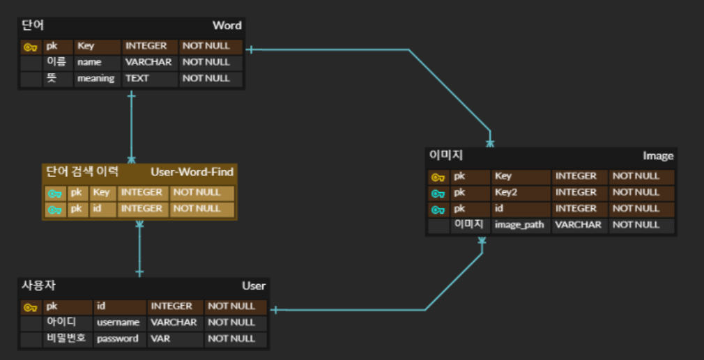

# 🛎️ 서비스 소개 및 구현

---

## 👀 인터페이스 한 눈에 보기

### 🍱 메인페이지

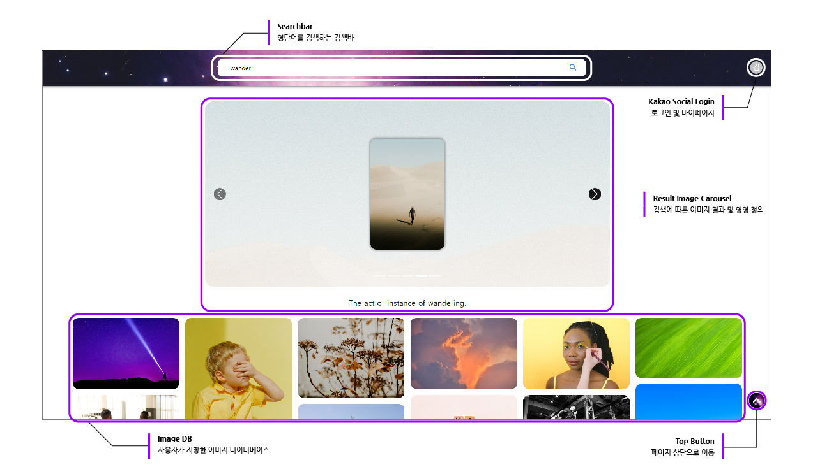

### 💻 반응형 페이지 구현

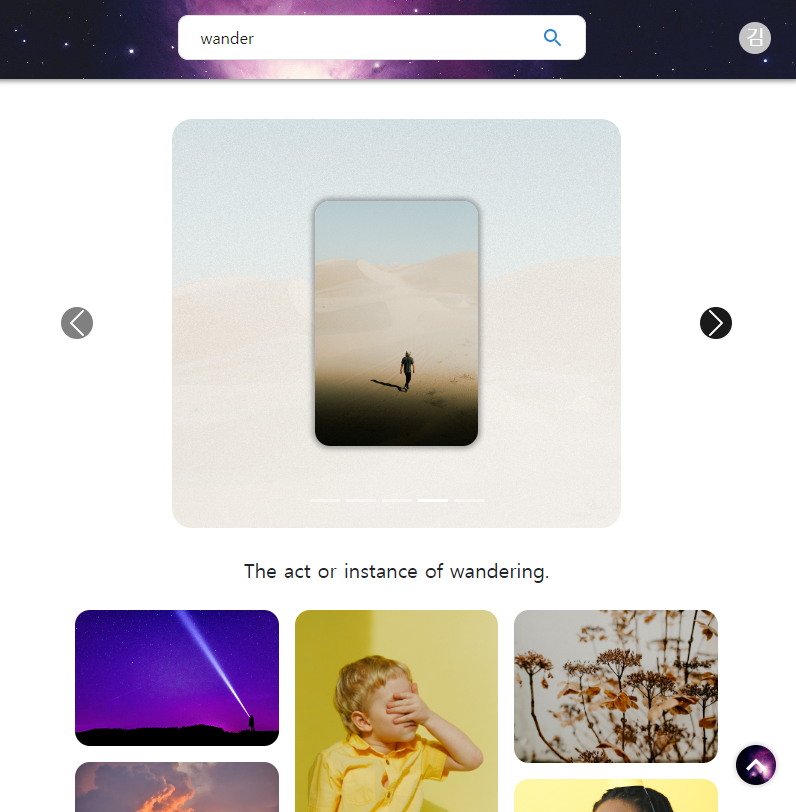

## 🔍 상세 기능

---

### 🔐 카카오 소셜 로그인(OAuth2)

1. 카카오 로그인 버튼을 통해 Front에서 KAKAO에 로그인 창을 요청
2. KAKAO에서 로그인 성공 시, access_token을 받아 Back에 axios 요청
3. Back에서 access_token으로 다시 KAKAO에 해당 사용자의 정보를 요청
4. 사용자 정보를 기존 회원 DB와 비교하여, 유무 여부에 따라 회원가입 혹은 로그인

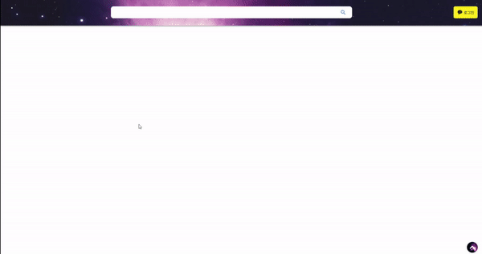

### 단어 검색

1. Pexels 및 Dictionary API를 통해 검색 단어에 대한 이미지와 영영 뜻을 요청
    - 사진만 or 단어 뜻만 존재하는 경우 or 빈칸인 경우 → alert 메시지 출력
    - 둘 다 존재할 경우
        - 사진 Carousel이 등장하고 밑에 단어의 뜻이 나온다.
        - 사진 Carousel은 최대 5개로 구성되어 있다.
2. 해당 검색 결과가 부족할 경우 오류창을 반환
3. 검색 결과가 충분할 경우 5개의 이미지 Carousel과 함께 대표 영영 뜻을 게시

### 단어 DB 저장

1. 이미지 Carousel의 각 카드에 마우스 hover 시 저장 아이콘 표시
2. 해당 아이콘 혹은 이미지 카드 영역 클릭 시 Back에 저장 요청
3. 저장 후 확인 피드백 모달창 반환

### 단어 DB 확인

1. 저장된 이미지 카드 Hover하면 카드가 뒤집히면서 해당 이미지의 영단어가 표시
2. 표출된 영단어를 보면서 해당 단어의 의미 리마인드
3. 사용자가 의미 연상에 실패할 경우, 클릭하여 상세 이미지 설명 Carousel 실행
4. Carousel 안에서 확대 이미지, 영단어, 영영 뜻 확인
- 사진을 클릭하게 되면 저장이 완료됐다는 alert 문을 표시하고 carousel의 삭제, 이미지의 추가가 이루어진다.

### 단어 DB 삭제

1. 하단에 위치한 각 이미지 카드의 X 표시 클릭 시 Confirm 메시지 모달 반환
2. 삭제를 누를 시 BackEnd에 삭제 요청이 보내지며 화면 및 DB에서 삭제
   
    
    

# 🛎️ 문제 상황 및 해결 방안

---

### 🧑🏻‍🦳 최은우

⚠️ **문제**

- Kakao Oauth 소셜 로그인
    - 토큰을 받기 위한 인가 코드와 토큰을 받는 함수를 둘다 장고에서 구현
      
        → 소셜 로그인은 해당 새로운 url에 요청을 보내는 것이여서 다시 프론트 url로 돌아오기 위해서는 백엔드쪽에서 Redirect를 시켜줄 수 밖에 없음
        
        → HTTP의 성격상 Rdirect시에 데이터를 넘겨줄 수 없어 프론트에서 유저의 인증 정보를 저장할 수 없었음
        

🧑🏼‍🔧 **해결 방안**

- 인가 코드를 받는 코드는 프론트에서 구현
- 그 후 인가 코드로 카카오 토큰을 받은 뒤 redirect url을 백엔드의 url로 지정하여 자체 서비스에 로그인 및 회원 가입을 처리하고 생성한 토큰을 Json Response로 프론트로 전송하여 유저의 인증 정보를 프론트에서 저장할 수 있게 구현

⚠️ **문제**

- DB에 단어 저장(post)요청을 보낼 때 단어가 이미 저장되어 있는지 아닌지 검사하는 구문이 있음
- 그런데 DB에 최초로 단어를 저장하는 요청의 경우 단어(Word)의 Query Set이 None타입이기 때문에 검사하는 구문이 정상적으로 작동하지 않음

🧑🏼‍🔧 **해결 방안**

- 처음 저장하는 경우와 그 외의 경우를 Django의 views.py에서 구분해놓음
  
    

### 🧚🏻‍♂️ **김신철**

⚠️ **문제**

- 검색 결과 이미지 Carousel 구현
    - 반환되는 이미지마다 규격이 다름
    - API 요청 시 Horizontal, Vertical, Min-Width 등을 설정할 수 있지만, 결과 이미지의 정확성 및 다양성이 떨어질 가능성
    - 하단의 개개인의 이미지 DB에 많은 이미지가 노출되기 때문에 상대적으로 결과 이미지가 Hierarchy적으로 묻힐 가능성
    - 이미지의 크기를 키운다고 해도, 규격이 다를 경우 UI가 들쑥날쑥하게 바뀌게 됨

🧑🏼‍🔧 **해결 방안**

- 결과 이미지를 동일한 규격의 Background 위에 카드 형식으로 디스플레이
    - 폭, 너비가 동일하기 때문에 용이하게 Carousel 구현 가능
    - Background 이미지를 통해 전체적인 이미지 크기를 확보하고 사용자의 시선을 끎

⚠️ **문제**

- 이미지 DB 디스플레이
    - 이미지마다 규격이 달라 그리드의 통일성을 주기 어려움
    - 영단어, 의미, 이미지, 삭제 버튼 등을 동시에 보여주기에는 정보의 양이 지나치게 많아 사용자로 하여금 혼란을 야기함
    - 모달 창만으로 영단어 및 이미지에 대한 정보를 확인할 수 있도록 한다면 사용자가 매번 창을 열고 닫아야 하는 수고가 발생

🧑🏼‍🔧 **해결 방안**

- Masonry를 활용한 다양한 높이의 이미지를 담는 그리드 생성
- 평상시에는 이미지만 보이게 하여 사용자에게 제공되는 시각적 정보를 최소화하고 마우스 Hover 시에 이미지가 뒤집히면서 영단어, 버튼 등이 보이게 함
  
    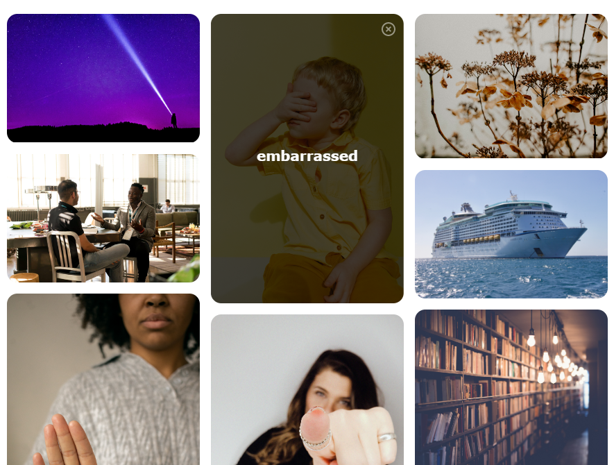
    

⚠️ **문제**

- 오류 상황 피드백
    - 로그인을 하지 않은 상태에서는 이미지를 DB에 저장할 수 없음
    - API에 따라 단어나 이미지가 검색 결과가 나오지 않는 경우가 발생
    - 사용자가 실수로 빈칸을 검색하거나 오타를 포함한 단어를 검색할 수 있음

🧑🏼‍🔧 **해결 방안**

- 로그인 하지 않은 상태에서 저장을 시도할 경우 카카오 로그인 창으로 Redirect
  
    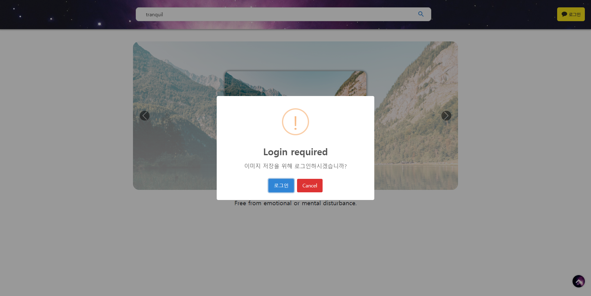
    
- API 요청 결과가 없거나, 빈칸을 보낼 경우 검색결과가 없음을 알리는 Alert 창을 띄움
  
    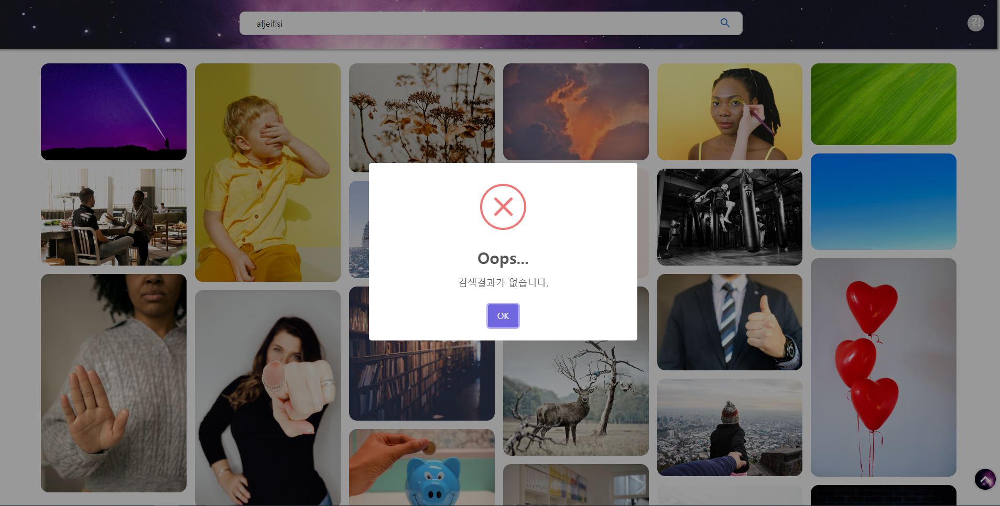
    

⚠️ **문제**

- 반응형 페이지
    - 다양한 배치된 이미지가 디스플레이 폭에 관계 없이 시각적 정보를 혼동 없이 잘 전달할 수 있도록 해야함

🧑🏼‍🔧 **해결 방안**

- Media query를 활용하여, 화면의 너비에 따라 그리드의 갯수를 조절할 수 있도록 함

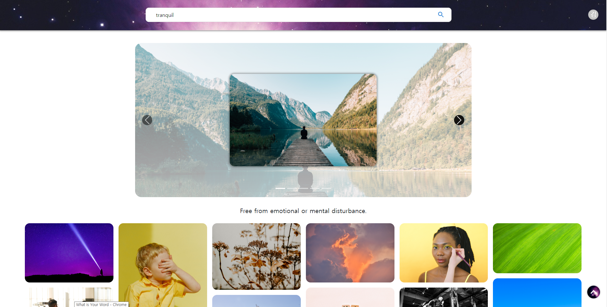

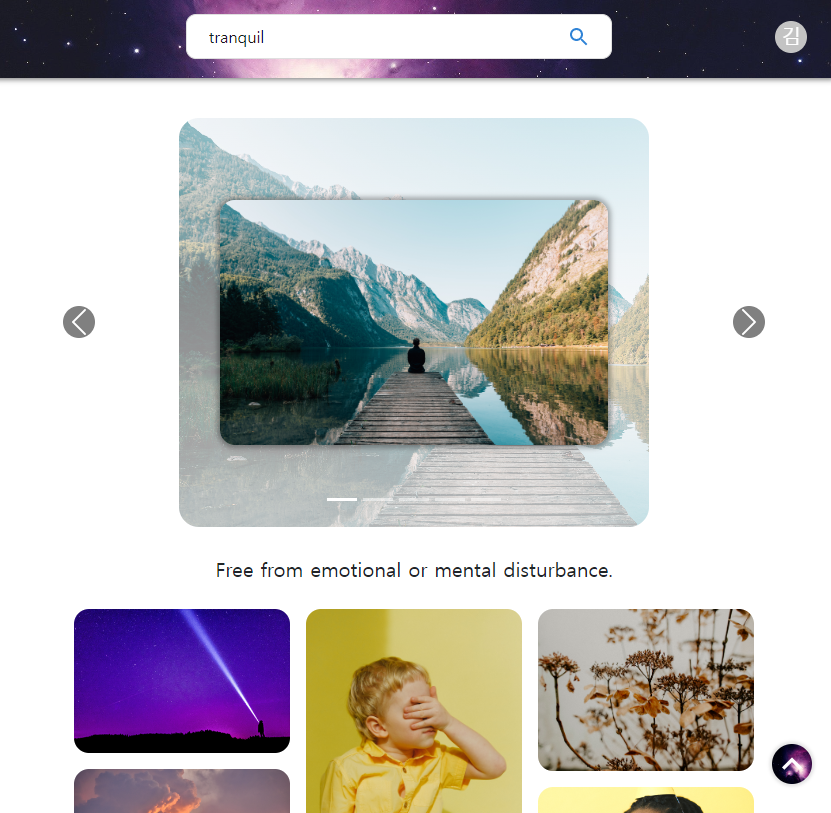

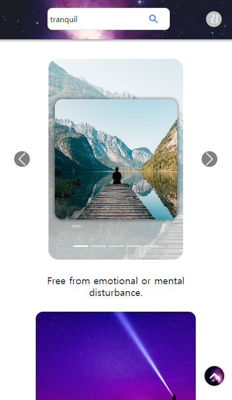

- 모달창으로 띄운 이미지 역시 다양한 화면 너비에 따라서도 반응형으로 움직이도록 함

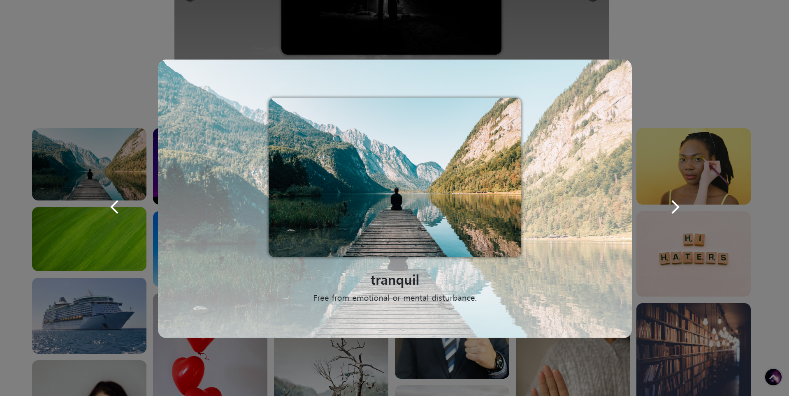

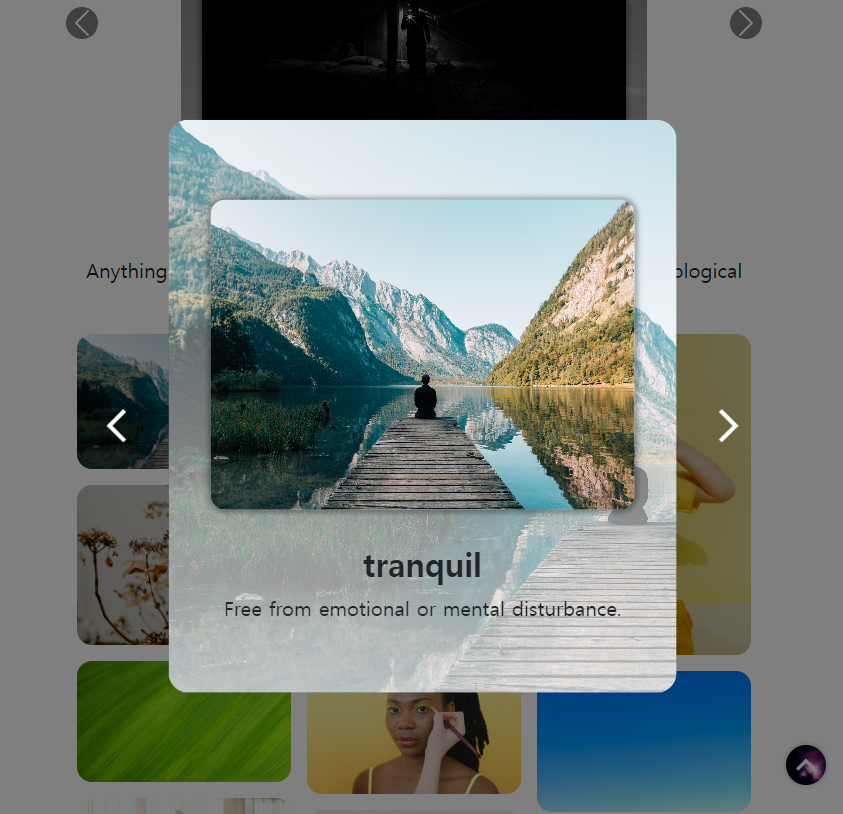

### 👦🏻 **박종민**

⚠️ **문제**

Pixabay API를 이용한 사진들이 만료가 되어 이미지가 사라지는 문제점이 발생

🧑🏼‍🔧 **해결 방안**

pexels 사진 API를 사용하는 것으로 변경. DB에 이미지를 저장하는 방식도 있었지만 백엔드 코드를 수정할 것이 많고 기간이 조금밖에 남아있지 않은 상황이라 url로 사진을 접근을 허락해주는 사진 API를 사용

⚠️ **문제**

Props로 가져오기 어려운 변수들의 상태 변화는 어떻게 해결할 것인가?

🧑🏼‍🔧 **해결 방안**

redux를 사용하여 편하게 짤 수 있는 코드들은 **redux-toolkit**을 활용하여 **useSelector**를 통해 어떤 컴포넌트에 있던 store에서 가져와 사용하게 만듦

⚠️ **문제**

Kakao 로그인을 한 이후 로그인 한 상태를 어떤 식으로 판별할 것인가

🧑🏼‍🔧 **해결 방안**

Redirect uri를 통해 POST 요청을 보낸 후 token, social_id, access_token, nickname 등의 정보를 localStorage에 저장함 → window.location.replace를 이용하여 메인페이지로 redirect

로그아웃할 상황에는 localStorage에 있는 값들을 모두 제거

⚠️ **문제**

CSS가 중복되는 코드들이 있었고 분리가 되어있지 않아 필요할때 찾아서 수정하는 작업이 쉽지 않아 시간이 오래 걸림

🧑🏼‍🔧 **해결 방안**

**리팩토링** 작업을 통해 각 파일들마다 CSS를 묶음으로 만들어 폴더 형태로 변경하는 작업을 수행

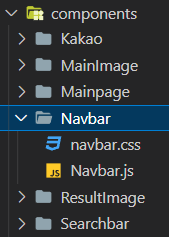

⚠️ **문제**

배포는 어떻게 할 것인가?

🧑🏼‍🔧 **해결 방안**

실제로 AWS EC2와 Netlify를 이용하여 배포를 시도했고 페이지는 나왔지만 카카오 로그인 리다이렉트 문제로 인해 시간을 많이 소모해 결국에는 배포보다는 리팩토링에 중점을 두는 선택을 하였습니다. 리팩토링을 하는 도중에 배포 전에도 카카오 로그인 문제가 있는 것을 나중에 발견하여 안타깝지만 리팩토링과 코드 리뷰가 얼마나 중요한 역할을 하는지 알게 되었습니다. 생각지도 못한 오류들을 볼 수 있었습니다. 앞으로 프로젝트를 하며 우선순위를 더 생각해 볼 필요가 있을 것 같습니다.

## 💬 개발자 인터뷰

---

### Q. 프로젝트를 끝낸 소감이 어떤가요?

### 🧑🏻‍🦳 최은우

🎙️ 데이터베이스 모델 구조를 ERD를 통해 나타내고 Django에서 Model, Serializer, [views.py](http://views.py) 함수들을 통해 프론트와의 소통을 구현하며 Django 프레임워크에 조금 더 익숙해진 점은 좋으나 아직 Django의 기능들 중 정확히 이해하지 못하는 것들이 남아있어 학습이 더 필요하다고 느꼈다. 또한 프론트엔드 중 특히 CSS부분에 아직 익숙하지 못하고 기여를 못해 그 부분도 더욱 학습하고 노력해야 되겠다고 느꼈다. 

### 🧚🏻‍♂️ **김신철**

🎙️ 리액트를 익혀가면서 프로젝트를 진행하다보니 원하는 기능을 바로바로 구현해내지 못해 어려움이 많았다. 그럼에도 원하는 기능을 모두 구현하는 데에 성공했기 때문에 스스로에게 박수를 보내고 싶다. 특히, 카카오 로그인에 거의 대부분의 시간을 쏟았다고 해도 과언이 아닌데, 결국 문제를 해결해서 기쁘고 뿌듯하다.

### 👦🏻 **박종민**

🎙️ BE에서 모르는 부분을 BE를 담당했던 팀원에게 여러가지 소통을 하며 프로젝트를 진행하며 많이 배웠습니다. 소셜 로그인 부분은 다시 공부를 해봐야 할 것 같지만 재미있는 경험 이였습니다!

### Q. 프로젝트를 하면서 배운 점이 있다면, 어떤 것인가요?

### 🧑🏻‍🦳 최은우

🎙️ 이전 프로젝트에서 Vue를 사용했을 때와는 다르게 React를 사용하여 어려운 점이 많았다. 구체적으로 Vue는 자체적인 문법(v-bind 등)을 통해 자바스크립트 문법을 사용하지 않아도 해결되는 부분이 많아 자바스크립트 공부를 소홀히 했었다. 하지만 React를 사용하며 React는 자바스크립트 실력이 React실력을 나타내는 지표이기 때문에 정말 많이 헤맸다. 결국에 어느 프레임워크를 사용하든지 기본 프로그래밍 언어를 충분히 습득하고 내 것으로 만드는 것이 가장 중요하다는 것을 깨달았다.

Django의 ORM구문도 부족함을 느꼈다. 이전에도 M:N관계, 1:N관계의 모델 구조를 짜고 Django에서 구현하여 사용한 적은 있으나 참조 관계인 모델들을 전부 CRUD를 해본 적이 없었다. 그러다보니 중계 테이블 값을 생성하는 ORM구문, 삭제하는 구문 등을 몰라 헤맸었고, Django의 도움을 받아 SQL문을 사용하는 것은 역시 처음 배웠을 때처럼 SQL문을 직접 사용하는 것 만큼은 많은 기능을 사용하지 못한다는 것을 느꼈다. 이것도 결국에 프론트에서 느낀 것과 비슷하게 기본적인 프로그래밍 언어의 실력이 우선 뒷받침되어야 한다는 것을 느꼈다. 

### 🧚🏻‍♂️ **김신철**

🎙️ 이전 프로젝트에서 CSS 등에서 사용되는 클래스명, 변수 등을 제대로 통일하지 못해 어려움을 겪었었는데, 이번에는 이것들을 프로젝트를 진행하면서 맞춰나가는 과정이 있어서 비교적 원활하게 서로의 코드를 알아볼 수 있었다. 앞으로도 프로젝트를 시작할 때 서로의 코딩 스타일을 공유하고 컨벤션 등을 정하는 것이 중요하다는 것을 깨달았다.

카카오 로그인을 구현하면서 프론트 개발자라고 해서 프론트 지식만 가지고 있는다고 되는 것이 아니라 백에 대한 이해도 필요하다는 것을 깨달았다. 뿐만 아니라 HTTPS 등을 비롯한 네트워크 지식이 매우 중요하다고 느꼈다. 앞으로 해당 부분을 스스로 배워나가야겠다.

프로젝트를 진행하면서 구글이나 stackoverflow의 도움을 받아가면서 스스로 직접 코드를 짜 구현을 한 것들이 꽤 있었다. 그런데 프로젝트 후반이 되면서 정확도를 높이는 과정에서 이를 손쉽게 정리할 수 있는 라이브러리가 많다는 것을 발견하여 더 완성도 높은 라이브러리의 코드로 수정하게 되었다. 짧은 프로젝트 기간 동안 직접 모든 코드를 짜려고 생각하기보다 라이브러리 등을 먼저 찾아봤더라면 시간을 아낄 수 있지 않았을까 하는 아쉬움이 남는다.

### 👦🏻 **박종민**

🎙️ 정리를 잘 하는 것이 가장 중요하다는 것을 뼈저리게 느꼈습니다. 정리를 하게 되면 그 날 고생했던 경험들을 다시 복기하며 경험치를 쌓을 수 있지만 정리를 안 해 같은 곳에서 경험했던 어려움을 똑같이 반복하는 일들이 생겼습니다. 코딩 만큼이나 그 날 있었던 일들을 **README** 에 작성하는 습관을 길들이겠습니다.

Kakao Oauth2 관련 문서를 보며 카카오 소셜 로그인을 구현하는 도중 **CORS** 문제, **Redirect** 문제를 수십 번은 봤던 기억이 납니다. 아직 제가 **HTTP CS** 공부를 제대로 하지 않아 이런 오류들을 쉽게 해결하지 못한 점이 아쉽게 느껴집니다. 앞으로 CS 공부도 같이 하는 방향으로 나아가겠습니다.

마지막으로 라이브러리를 많이 사용하여 코드가 무거워지고 사이트에 사진이 많으면 효과적인 **custom hook**들을 사용하지 않아 렌더링 시간이 오래 걸려 결과가 생각만큼은 나오지 못했던 것 같습니다. React Hook들을 좀 더 잘 다룰 수 있으면 **리팩토링** 과정 또는 코드를 짜는 과정에서 상황들을 고려하여 다양하게 사용할 수 있을 것 같아 React 공부를 더 해야겠다는 생각이 듭니다.